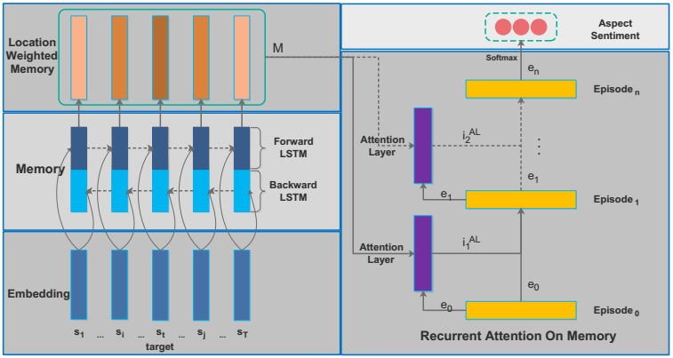

# ABSA-PyTorch

> Aspect Based Sentiment Analysis, PyTorch Implementations.
>
> 基于方面的情感分析，使用PyTorch实现。

  

## Requirement

* PyTorch 0.4.0
* NumPy 1.13.3
* tensorboardX 1.2
* Python 3.6
* GloVe pre-trained word vectors (See `data_utils.py` for more detail)
  * Download pre-trained word vectors [here](https://ai.tencent.com/ailab/nlp/data/Tencent_AILab_ChineseEmbedding.tar.gz),
  * extract the Tencent_AILab_ChineseEmbedding.txt to the root directory

## Usage

### Training

```sh
python train.py --model_name ian --logdir ian_logs
```

### See the training process (needs to install TensorFlow)

```sh
tensorboard --logdir=./ian_logs
```

## Implemented models

### RAM ([ram.py](./models/ram.py))
Chen, Peng, et al. "Recurrent Attention Network on Memory for Aspect Sentiment Analysis." Proceedings of the 2017 Conference on Empirical Methods in Natural Language Processing. 2017. [[pdf]](http://www.aclweb.org/anthology/D17-1047)



### IAN ([ian.py](./models/ian.py))
Ma, Dehong, et al. "Interactive Attention Networks for Aspect-Level Sentiment Classification." arXiv preprint arXiv:1709.00893 (2017). [[pdf]](https://arxiv.org/pdf/1709.00893)


### LSTM ([lstm.py](./models/lstm.py))


